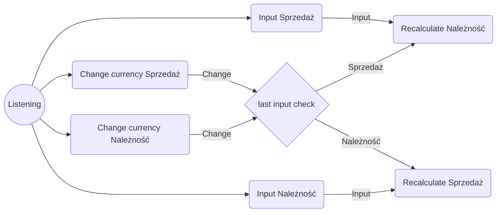

# Currency Converter
## What is my project
This website project has been created by request of my web development course. I had to program from start to the end a simple but fully functioning currency converter.

[Demo](https://headershoter.github.io/CurrencyConverter/)
## Functions
This currency converter gives user possibillity do check amount of money he will get when sell choosen amount of choosen currency.
If you like you can also chceck how much money you would you need to sell to get needed amount of another currency.
## How it works
To check how much money you will get after sale of your currency just start typing amount in "Sprzedaż". Then program will immediately calculate how much you will get depending on currency types marked next to the input fields and display result in "Należność"

You can chage marked currencys in any time. Then program will immediately recalculates result for changed currency configuration starting with non latest input field.

If you want to check how much money you should put to get required amount of other currency you can just type this amount in "Należność" and program will display how much money you would spend to get it.
## Conventions used
Entire site has been coded with using BEM
## Algorythm
