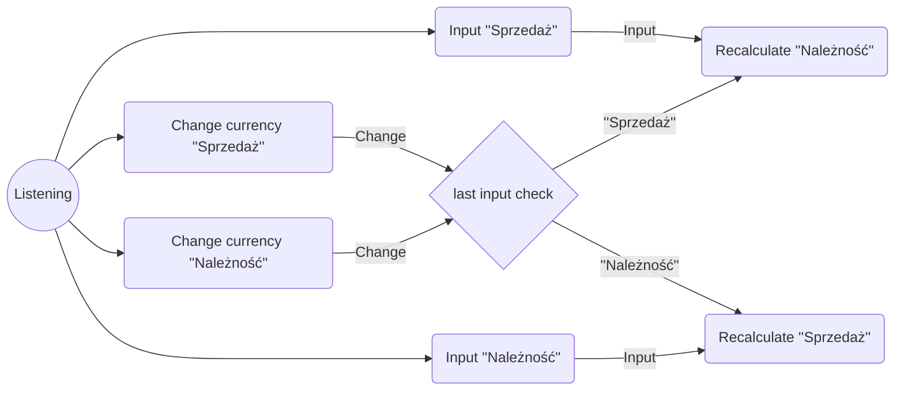

# Currency Converter
## What is my project
This website project was created at the request of my web development course. I had to program, from start to finish, a simple but fully functioning currency converter.
[Demo](https://headershoter.github.io/CurrencyConverter/)
## Functions
This currency converter gives the user the possibility to check the amount of money he will get when selling a chosen amount of chosen currency.
If you like, you can also check how much money you would need to sell to get the needed amount of another currency.
## How it works
To check how much money you will get after selling your currency, just start typing the amount in "Sprzedaż". Then the program will immediately calculate how much you will get depending on the currency types marked next to the input fields and display the result in "Należność".

You can change marked currencies at any time. Then the program will immediately recalculate the result for the changed currency configuration, starting with the non-latest input field.

If you want to check how much money you should spend to get the required amount of another currency, you can just type this amount in "Należność" and the program will display how much money you would spend to get it.
## Conventions used
The entire site has been coded using BEM
## Algorythm
